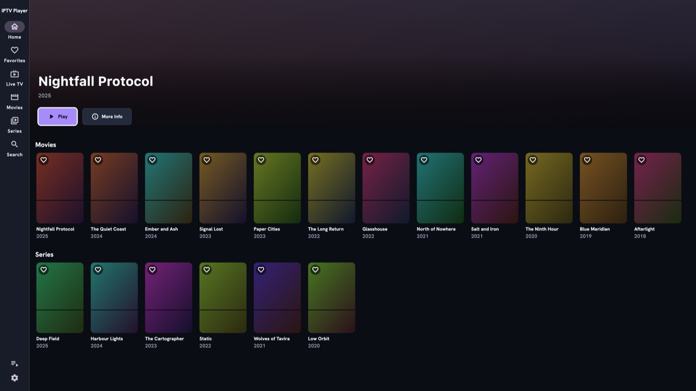
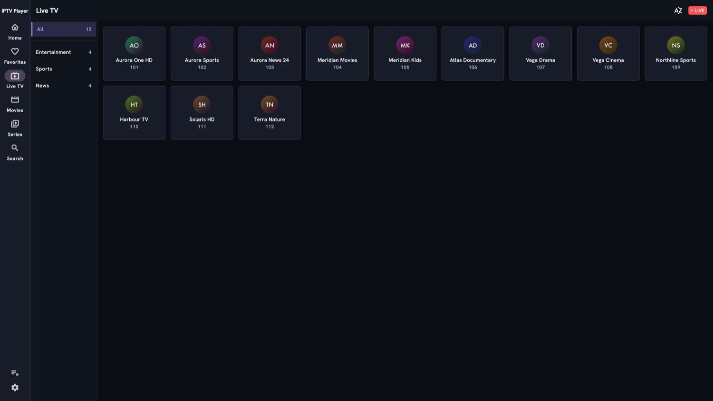
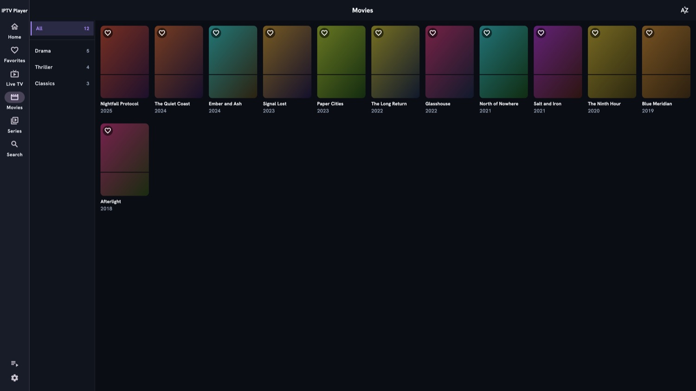
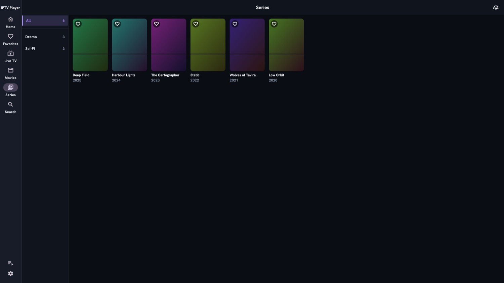
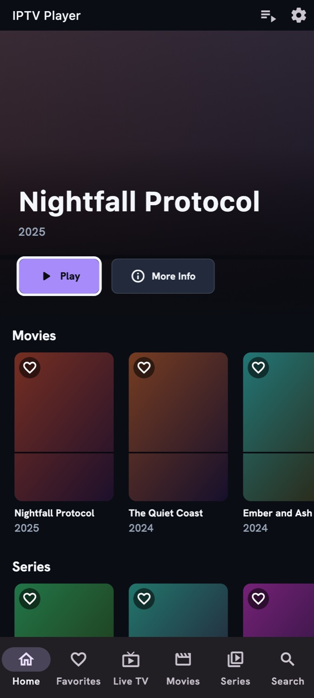
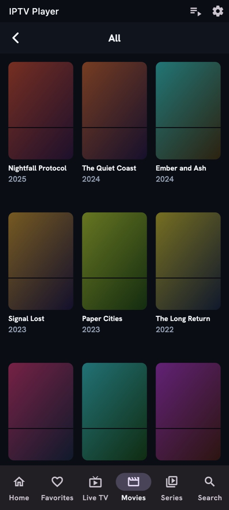
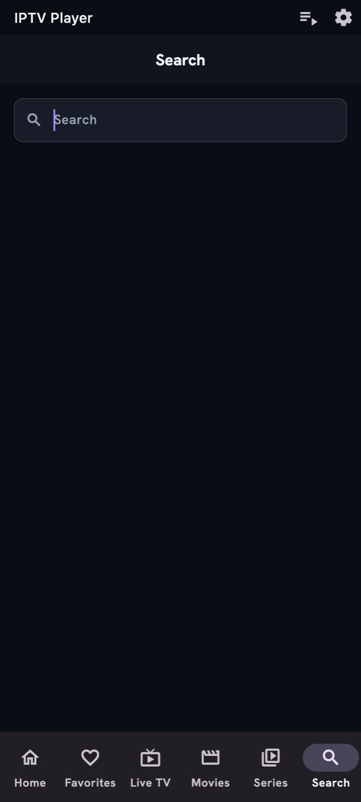

# IPTV Player

Watch your IPTV subscription on the TV, phone or computer — with a proper
remote-friendly interface.

**Android TV • Android phone • macOS • Windows • Linux**

[**Download the latest release →**](https://github.com/abdelaziz-mahdy/iptv_player/releases/latest)

---

> This app comes with **no channels and no content**. You bring your own
> playlist from whichever provider you already subscribe to.

## Screenshots

### Android TV / desktop

| Home | Live TV |
|---|---|
|  |  |

| Movies | Series |
|---|---|
|  |  |

### Phone

| Home | Movies | Search |
|---|---|---|
|  |  |  |

## Getting set up

1. **Install it.** Grab the file for your device from the
   [latest release](https://github.com/abdelaziz-mahdy/iptv_player/releases/latest):

   | Your device | File |
   |---|---|
   | Android phone or TV | `.apk` |
   | macOS | `-macos.zip` |
   | Windows | `-windows-x64.zip` |
   | Linux | `-linux-x64.tar.gz` |

2. **Add your playlist.** Open the app and go to **Playlists → Add**. You can use
   either:
   - **Xtream Codes** — the server address, username and password your provider
     gave you. This gets you live TV, movies, series and the TV guide.
   - **M3U / M3U8** — a playlist link or a file, optionally with an XMLTV guide
     URL.

3. **That's it.** Your channels, movies and series appear under their own tabs.

### Installing on an Android TV

TVs have no browser for downloading files, so either install the free
**Downloader** app from the Play Store and enter the release link, or copy the
`.apk` across on a USB stick.

### First launch on macOS

The macOS build isn't signed with an Apple developer certificate, so macOS will
refuse to open it on the first try. Right-click the app and choose **Open**, then
confirm — you only need to do this once.

## What it does

- **Live TV, movies and series**, organised by your provider's own categories,
  with a TV guide where your playlist supplies one.
- **Picks up where you left off.** Movies and episodes remember your position,
  even if the app is closed or the TV kills it in the background. Finished items
  drop out of Continue Watching on their own.
- **Finds things fast.** Search across everything, jump to a letter in long
  channel lists, and the categories you actually use float to the top.
- **Favourites** for the channels and titles you keep coming back to.
- **Built for a remote.** Every screen is navigable with a D-pad, with a clear
  focus outline so you always know where you are, and TV-native text entry for
  search and login boxes.
- **Plays what other apps choke on.** A wide range of stream formats and codecs,
  with hardware decoding, and 4K on Android TV at the panel's full resolution.
- **Readable for everyone.** Larger text, reduced motion, a high-contrast theme,
  subtitle styling, and full right-to-left support with Arabic.

## Where it runs

| | |
|---|---|
| Android phone | ✅ |
| Android TV | ✅ |
| macOS | ✅ |
| Windows | ✅ |
| Linux | ✅ |
| iOS / Web | ❌ not planned |

## Contributing

Bug reports and pull requests are welcome — see
[docs/DEVELOPING.md](docs/DEVELOPING.md) to build and run it locally.

## License & disclaimer

Released under the [MIT License](LICENSE).

This application does not provide, host, or distribute any media. It is a player
for playlists supplied by the user. Ensure you have the right to access any content
you load.
